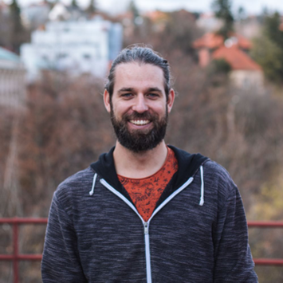
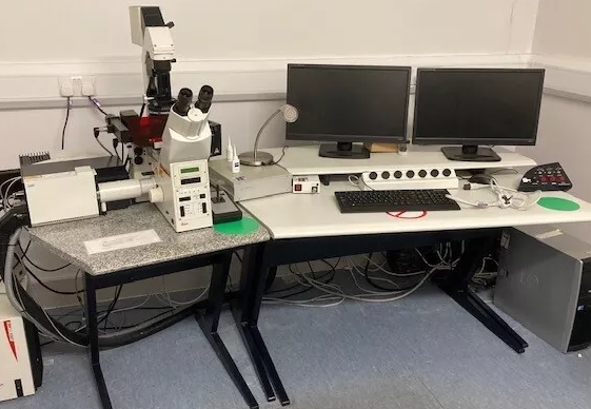
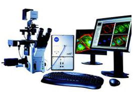

#   Viničná Microscopy Core Facility

## 🚀 About Us

Welcome to the Viničná Microscopy Core Facility! We are an open-access resource specializing in advanced microscopy and bioimage analysis. As part of the Laboratory of Confocal and Fluorescence Microscopy, we offer a wide range of services, including cutting-edge imaging technologies and expert analytical support to meet your research needs.

**Our Mission:** To offer consistent, high-quality microscopy and bioimage analysis services, enabling reproducible and impactful scientific research.

## 🤝 What we offer
|
 Consultations
|
 Services
|
 Training
|
|---|---|---|
|<li>Sample preparation</li><li>Imaging techniques</li><li>Bioimage analysis</li></ul>|<li>Advanced imaging</li><li>[Bioimage analysis](#bioimage-analysis-service)</li><li>User training</li>|<li>Personalized training</li><li>Workshops and group courses</li>|

## 👨‍💻 Our team
|||
|---|---|
||**Zuzana Burdíková**|
||**Martin Schätz**|
||**Judith Garcia-Gonzalez**|

## 🖥️ Bioimage Analysis service

## 📖 Our workshops and courses
* [Advanced Image analysis](https://is.cuni.cz/studium/predmety/index.php?do=predmet&kod=MB100T01)
* [Molecular Probes in Biomedical Imaging](https://is.cuni.cz/studium/predmety/index.php?do=predmet&kod=MB100P09)
* [Quantitative Microscopy](https://is.cuni.cz/studium/predmety/index.php?do=predmet&kod=MB100P08)
* [Image Analysis and Data Processing in Super-Resolution Microscopy (workshop)](https://vmcf-konfmi.github.io/workshop-IADPSRM/intro.html)
* [Fundamentals of bioimage analysis (workshop)](https://web.natur.cuni.cz/sekce-bi/VMCF/bioimage-analysis-fundamentals-2/)
  
## 🔬 Available light microscopy equipment
### Confocal microscopes 
||||
|---|---|---|
|Leica TCS SP8||<li>High-end confocal microscope with standard PMT and sensitive HyD detector.</li><li>Supports fixed and living samples.</li><li>Environmental chamber (PECON) with CO2 regulation for live-cell experiments</li><li>Multiple modes: lambda scanning, FRET, FRAP.</li><li>Equipped with MATRIX module for object tracking (e.g., oocytes, roots).</li>|
|Zeiss LSM 880 NLO||<li>Latest confocal microscope with one-photon and tunable Ti pulsed lasers for two-photon excitation.</li><li>High-sensitivity 32-channel GaAsp spectral detector.</li><li>Supports one-channel FLIM, FCS, and RICS measurements, enabling exploration of molecular relationships and functions.</li><li>Includes a live-cell imaging chamber with CO2 control.</li>|
|Leica TCS SP2||<li>High-end inverted confocal microscope with AOBS system, allowing high sensitivity and the combination of up to four fluorescence markers.</li><li>Supports multicolor analysis, 3D reconstructions, FRAP, FRET, and tile scans.</li><li> Includes a 405 nm diode laser, ideal for structural analysis of fixed samples.</li>|

### Wide-field microscopes

||||
|---|---|---|
|Olympus Scan^R||<li>High-throughput and mosaic imaging with a high-sensitivity Hamamatsu camera. </li><li>Stabilized light source, motorized stage, filter, and objective turrets and shutters.</li><li>High-quality stage chamber with temperature regulation (-5 to 65 °C) and gas control (CO2, O2).</li><li>Supports multiwell dishes, suitable for varied environmental conditions.</li>|
|NIKON TiE2||<li>High-speed monochromatic ORCA Flash camera (100 fps) and RGB camera.</li><li>Excitation Cool-LED P-4000 with 16 LEDs covering the full spectrum.</li><li>SEDAT system of emission filters and multiband dichroic.</li><li>OKOLab environmental chamber for living cell experiments.</li><li>Driven by NIS-elements software with High Content Imaging (JOBs module).</li>|
|ZEISS Axioscan Z.1||<li>Fully automated microscope with dock for 100 slides, capable of autonomous scanning.</li><li>High-throughput imaging ideal for tissue sections.</li><li> Enables 3D reconstruction of scanned samples.</li><li>Enables 3D reconstruction of scanned samples.</li>|

### Super-resolution microscopes
||||
|---|---|---|
|Zeiss Elyra PS.1 &nbsp;&nbsp;&nbsp;&nbsp;&nbsp;&nbsp;&nbsp;&nbsp;&nbsp;&nbsp;&nbsp;&nbsp;&nbsp;&nbsp;&nbsp;||<li> Utilizes Structured Illumination Microscopy (SIM) and precise localization (PALM/STORM) to surpass the diffraction barrier, achieving resolution 2-3x higher with SIM and up to 5 nm with localization microscopy.</li><li>Features Total Internal Reflection Fluorescence (TIRF) to increase the signal-to-noise ratio near the cover glass.</li>|

### Ligthsheet microscopes
||||
|---|---|---|
|Zeiss Lightsheet Z.1 ||<li> Ideal for rapid acquisition of fixed, living, or cleared samples using selective plane illumination.</li><li>Two pairs of 5x and 10x **illumination objectives** for flexible imaging.</li><li>Detection at 5x, 10x, 20x, and 40x magnifications, including two specialized 20x objectives for clearing with refractive indices (RI) of 1.38 and 1.45.</li><li>Sample chamber for specimens of up to 2x2x2cm volume.</li><li>Two-channel acquisition is powered by two cooled PCO cameras.</li>|

## 🔗 More information and latest news
 &nbsp; [VMCF GitHub](https://github.com/vmcf-konfmi)   &nbsp; [X (@IMCF_vinicna)](https://x.com/IMCF_vinicna)   &nbsp; [Viničná Microscopy Core Facility (VMCF)](https://web.natur.cuni.cz/sekce-bi/VMCF/)   &nbsp; [Laboratory of Confocal and Fluorescence Microscopy (KONFMI)](https://www.natur.cuni.cz/biology/service/laboratory-of-confocal-and-fluorescence-microscopy?set_language=en)