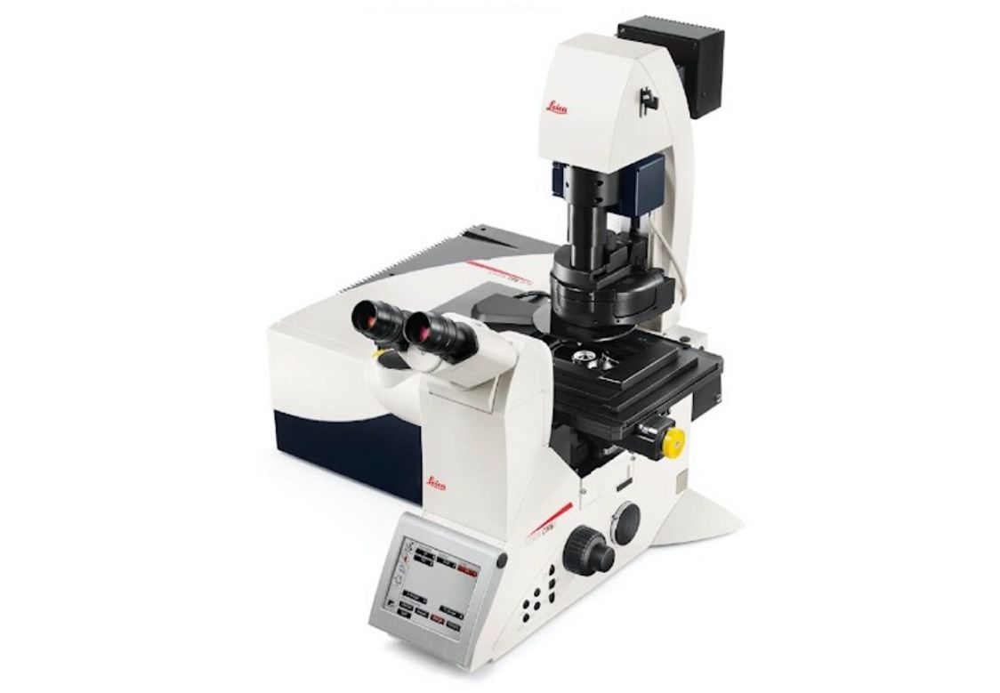
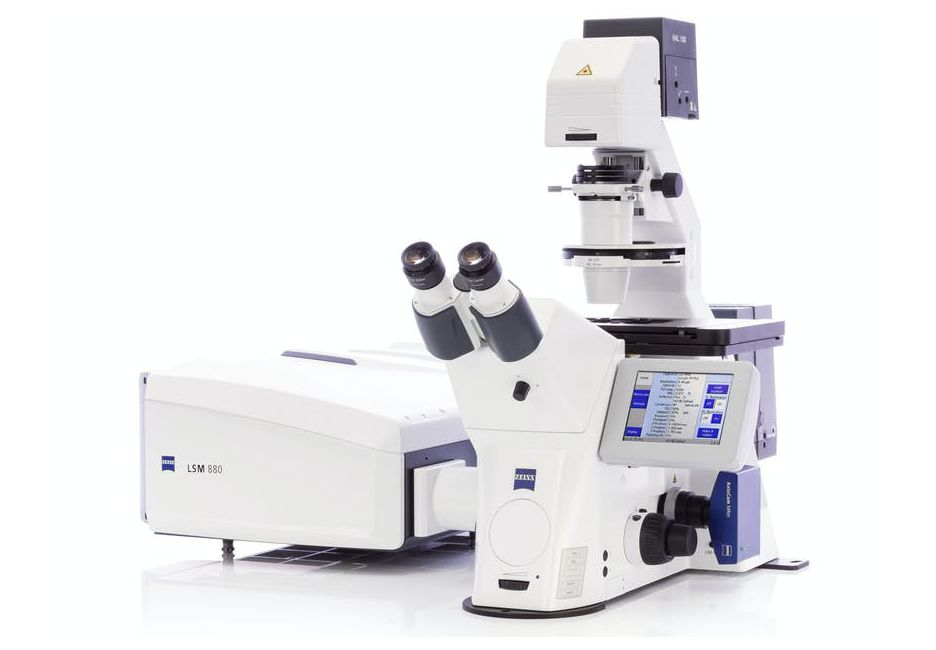
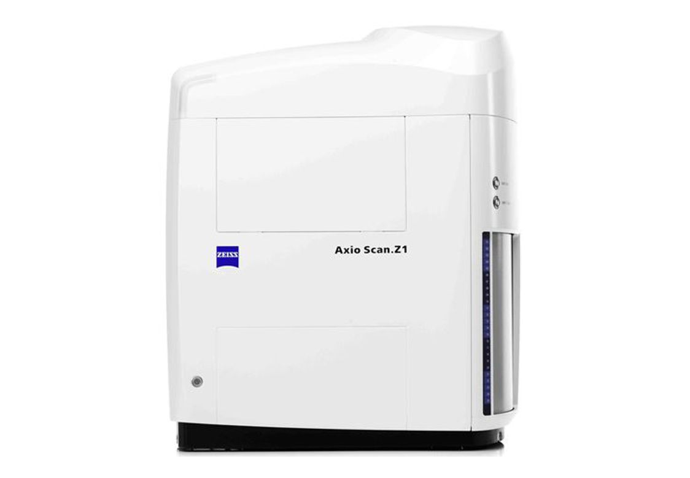
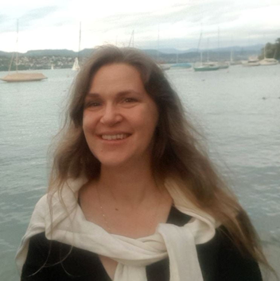

# <br> Viničná Microscopy Core Facility

## 🚀 About Us

Welcome to the Viničná Microscopy Core Facility! We are an open-access resource specializing in advanced microscopy and bioimage analysis. As part of the Laboratory of Confocal and Fluorescence Microscopy, we offer a wide range of services, including cutting-edge imaging technologies and expert analytical support to meet your research needs.

**Our Mission:** To offer consistent, high-quality microscopy and bioimage analysis services, enabling reproducible and impactful scientific research.

## 🤝 What we offer
|<div align="center"><br>Consultations</div>|<div align="center"><br>Services</div>|<div align="center"><br>Teaching</div>|
|---|---|---|
|<li>Sample preparation</li><li>Imaging techniques</li><li>Bioimage analysis</li></ul>|<li>[Advanced imaging](#-advanced-imaging---available-light-microscopy-equipment)</li><li>[Bioimage analysis](#%EF%B8%8F-bioimage-analysis-service)</li><li>User training</li>|<li>Personalized training</li><li>[Workshops and group courses](#-our-workshops-and-courses)</li>|

## 💡Image Analysis Consultancy
Our Image Analysis Consultancy provides personalized support to help you optimize and navigate your bioimage analysis workflows. Whether you're establishing new processes or refining existing ones, we're here to assist every step of the way.

### Arrange a Meeting
- **Booking**: Schedule an in-person or online meeting by selecting a slot through [Calendly](https://calendly.com/) or by emailing us with a brief description of your inquiry. This helps us prepare effectively for your session.

### Prepare for the Meeting
- **Necessary Preparation**: Select two (not more❗) example images, ideally opened in FIJI, so we can inspect the raw data in detail during the meeting. Choose images that represent the range of phenomena you're investigating (e.g., positive and negative controls).
  
- **Optional Data Sharing**: Sharing a minimal set of example data in advance can be very helpful. Details on data preparation can be found in the "Image Data Preparation" section below.

- **Optional Presentation**: If possible, prepare a short presentation covering the following topics:
  - **Scientific Background**: An overview of the project.
  - **Sample Preparation and Image Acquisition**: Details on the specimen, staining methods, and microscopy used.
  - **Example Images**: Ideally, provide treated and untreated images that show a clear difference. If not applicable, show a range of images to illustrate data variability.
  - **Technical Details**: Clarify the specific numbers you wish to measure, the volume of data (e.g., 10, 100, 1,000 images), image sizes, preferred software, and any preliminary analysis attempts.

### Image Data Preparation
- **Organize Your Data**: Select a minimal set of representative images that clearly show biologically relevant differences.
- **Suggested Folder Structure**:
  ```plaintext
  minimal-example-data/
  ├── condition01/
  │   └── condition01_image01.tif
  ├── condition02/
  │   └── condition02_image01.tif
  └── README.txt

## 🖥️ Bioimage Analysis service
We offer a range of open-access services tailored to meet the specific needs of your projects. Our services include:

- **Consultations**: 
  - Get expert advice on selecting software, plugins, and tools for your specific tasks.
  - Learn about available resources and get guidance on interpreting results or optimizing existing workflows.
  - **Time frame**: Typically from a few hours to a few days (depending on availability, check our Calendly for booking).

- **Workflow Setup**: 
  - Design and implement analysis workflows using specific tools or software.
  - We assist in setting up, testing, and optimizing software, and can help you re-run supplementary code from published papers using your data.
  - **Time frame**: Usually takes a few days to a few weeks.

- **Tool Development**: 
  - Collaborate with our team to develop, rewrite, or fine-tune BioImage Analysis tools through pair programming.
  - **Time frame**: Typically spans weeks to several months, depending on the complexity.

- **Workflow Execution**: 
  - We can run analysis workflows on your behalf using our pre-configured server, which includes both open-source and commercial BioImage Analysis tools.
  - **Time frame**: Varies based on the workflow's complexity.

If you're unsure where to start, we recommend scheduling a short consultation to discuss your needs and determine the best approach.

### Guidelines for Collaboration

To ensure a smooth and productive collaboration, please keep the following guidelines in mind:

- **Acknowledgment**: Any publications resulting from the use of our tools or services should include an acknowledgment of the facility.
- **Authorship**: If a team member provided significant intellectual input or contributed additional data (e.g., scripts, software, or numerical results), they should be acknowledged by name or considered for co-authorship.
- **Co-Authorship**: Co-authorship decisions should be made during the manuscript preparation stage. Co-authors reserve the right to review any manuscript containing results generated by the facility before submission.
- **Contributions**: Each author should have made substantial contributions to the work, approved the final version, and agreed to be accountable for their contributions to ensure the accuracy and integrity of the research.
- **Affiliations**: The primary affiliation for each author should be the institution where the majority of their work was conducted. If the author has since moved, their current address may also be included.
  
## 🔬 Advanced imaging - available light microscopy equipment
At our core facility, we offer advanced microscopy techniques, including super-resolution, confocal, and high-throughput imaging. Our team is here to help you select the best tools and fine-tune your workflows, ensuring you get the most valuable insights from your samples.

### Confocal microscopes 
||||
|---|---|---|
|Leica TCS SP8||<li>High-end confocal microscope with standard PMT and sensitive HyD detector.</li><li>Supports fixed and living samples.</li><li>Environmental chamber (PECON) with CO2 regulation for live-cell experiments</li><li>Multiple modes: lambda scanning, FRET, FRAP.</li><li>Equipped with MATRIX module for object tracking (e.g., oocytes, roots).</li>|
|Zeiss LSM 880 NLO||<li>Latest confocal microscope with one-photon and tunable Ti pulsed lasers for two-photon excitation.</li><li>High-sensitivity 32-channel GaAsp spectral detector.</li><li>Supports one-channel FLIM, FCS, and RICS measurements, enabling exploration of molecular relationships and functions.</li><li>Includes a live-cell imaging chamber with CO2 control.</li>|
|Leica TCS SP2||<li>High-end inverted confocal microscope with AOBS system, allowing high sensitivity and the combination of up to four fluorescence markers.</li><li>Supports multicolor analysis, 3D reconstructions, FRAP, FRET, and tile scans.</li><li> Includes a 405 nm diode laser, ideal for structural analysis of fixed samples.</li>|

### Wide-field microscopes

||||
|---|---|---|
|Olympus Scan^R||<li>High-throughput and mosaic imaging with a high-sensitivity Hamamatsu camera. </li><li>Stabilized light source, motorized stage, filter, and objective turrets and shutters.</li><li>High-quality stage chamber with temperature regulation (-5 to 65 °C) and gas control (CO2, O2).</li><li>Supports multiwell dishes, suitable for varied environmental conditions.</li>|
|NIKON TiE2||<li>High-speed monochromatic ORCA Flash camera (100 fps) and RGB camera.</li><li>Excitation Cool-LED P-4000 with 16 LEDs covering the full spectrum.</li><li>SEDAT system of emission filters and multiband dichroic.</li><li>OKOLab environmental chamber for living cell experiments.</li><li>Driven by NIS-elements software with High Content Imaging (JOBs module).</li>|
|ZEISS Axioscan Z.1||<li>Fully automated microscope with dock for 100 slides, capable of autonomous scanning.</li><li>High-throughput imaging ideal for tissue sections.</li><li> Enables 3D reconstruction of scanned samples.</li><li>Enables 3D reconstruction of scanned samples.</li>|

### Super-resolution microscopes
||||
|---|---|---|
|Zeiss Elyra PS.1 &nbsp;&nbsp;&nbsp;&nbsp;&nbsp;&nbsp;&nbsp;&nbsp;&nbsp;&nbsp;&nbsp;&nbsp;&nbsp;&nbsp;&nbsp;||<li> Utilizes Structured Illumination Microscopy (SIM) and precise localization (PALM/STORM) to surpass the diffraction barrier, achieving resolution 2-3x higher with SIM and up to 5 nm with localization microscopy.</li><li>Features Total Internal Reflection Fluorescence (TIRF) to increase the signal-to-noise ratio near the cover glass.</li>|

### Ligthsheet microscopes
||||
|---|---|---|
|Zeiss Lightsheet Z.1 ||<li> Ideal for rapid acquisition of fixed, living, or cleared samples using selective plane illumination.</li><li>Two pairs of 5x and 10x **illumination objectives** for flexible imaging.</li><li>Detection at 5x, 10x, 20x, and 40x magnifications, including two specialized 20x objectives for clearing with refractive indices (RI) of 1.38 and 1.45.</li><li>Sample chamber for specimens of up to 2x2x2cm volume.</li><li>Two-channel acquisition is powered by two cooled PCO cameras.</li>|

## 📖 Our workshops and courses
* [Advanced Image analysis](https://is.cuni.cz/studium/predmety/index.php?do=predmet&kod=MB100T01)
* [Molecular Probes in Biomedical Imaging](https://is.cuni.cz/studium/predmety/index.php?do=predmet&kod=MB100P09)
* [Quantitative Microscopy](https://is.cuni.cz/studium/predmety/index.php?do=predmet&kod=MB100P08)
* [Image Analysis and Data Processing in Super-Resolution Microscopy (workshop)](https://vmcf-konfmi.github.io/workshop-IADPSRM/intro.html)
* [Fundamentals of bioimage analysis (workshop)](https://web.natur.cuni.cz/sekce-bi/VMCF/bioimage-analysis-fundamentals-2/)

## 👨‍💻 Our team
|||
|---|---|
||**Zuzana Burdíková**|
||**Martin Schätz**|
||**Judith Garcia-Gonzalez**|

## 🔗 More information and latest news
 &nbsp; [VMCF GitHub](https://github.com/vmcf-konfmi)<br>  &nbsp; [X (@IMCF_vinicna)](https://x.com/IMCF_vinicna)<br>  &nbsp; [Viničná Microscopy Core Facility (VMCF)](https://web.natur.cuni.cz/sekce-bi/VMCF/)<br>  &nbsp; [Laboratory of Confocal and Fluorescence Microscopy (KONFMI)](https://www.natur.cuni.cz/biology/service/laboratory-of-confocal-and-fluorescence-microscopy?set_language=en)